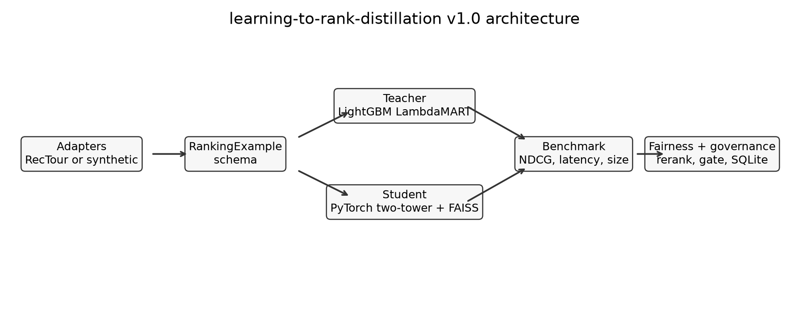

# learning-to-rank-distillation

[](https://github.com/saralabiswal/learning-to-rank-distillation/actions/workflows/ci.yml)


Dataset-agnostic tooling for ranking-model distillation and marketplace-aware reranking.

v1.0 is scoped by [`REQUIREMENTS.md`](REQUIREMENTS.md). Future work lives in
[`ROADMAP.md`](ROADMAP.md). A longer technical narrative is in
[`docs/technical_writeup.md`](docs/technical_writeup.md).

## Motivation

This project started as a focused way to close two gaps for an Expedia Senior Director, ML/AI
interview loop: ranking-model distillation and multi-objective marketplace ranking. The code is
intentionally built as reusable infrastructure instead of an Expedia-only script. Amazon ESCI is the
primary public real-data flow because it has a query-candidate-relevance shape that maps cleanly to
learning-to-rank. Expedia RecTour remains the secondary travel-marketplace target, and all downstream
code consumes the shared `RankingExample` schema.

## Architecture



The main flow is:

1. Dataset adapter maps raw rows into `RankingExample`.
2. Teacher trains a LightGBM LambdaMART ranker.
3. Student trains a PyTorch two-tower model, either with response-based KD or label-only no-KD.
4. Benchmark compares quality, latency, and size.
5. Fairness layer sweeps exposure floors and plots relevance vs. exposure fairness.
6. Promotion gate logs governed decisions to SQLite.

## Install

```bash
pip install -e ".[dev]"
# Optional dashboard:
pip install -e ".[dev,dashboard]"
```

## Run

```bash
pytest tests/ -v
ruff check .
ruff format --check .
python -m learning_to_rank_distillation.benchmark.run_all
python -m learning_to_rank_distillation.benchmark.promotion_check \
  --benchmark-table artifacts/benchmark_table.json \
  --max-ndcg-drop 0.50 \
  --min-latency-improvement 0.25
```

The CLI alias is also available after installation:

```bash
ltrd benchmark
ltrd benchmark --dataset esci --data-dir data/esci --limit 5000
ltrd distillation-ablation
ltrd train-teacher --dataset synthetic
ltrd train-teacher --dataset esci --data-dir data/esci --limit 5000
ltrd generate-synthetic-rectour --output-path data/synthetic/rectour_like.csv
make cross-dataset
make dashboard
ltrd-serve --bundle-path artifacts/bundles/current
docker compose up --build
```

## Benchmark Table

Example local run on the enriched synthetic fallback fixture:

| model | NDCG@5 | NDCG@10 | size bytes | p50 ms | p99 ms |
|---|---:|---:|---:|---:|---:|
| teacher-lightgbm | 0.3763 | 0.5237 | 111705 | 1.321 | 1.642 |
| student-no-kd-d16 | 0.4181 | 0.5543 | 36096 | 1.178 | 1.480 |
| student-kd-d8 | 0.4121 | 0.5482 | 33984 | 1.174 | 1.461 |
| student-kd-d16 | 0.4121 | 0.5482 | 36096 | 1.182 | 1.376 |
| student-kd-d32 | 0.4121 | 0.5515 | 40320 | 1.219 | 1.387 |

## Distillation Ablation

Example local run on the synthetic fallback fixture with the transformer teacher:

| model | NDCG@5 | NDCG@10 | final loss |
|---|---:|---:|---:|
| teacher-transformer | 0.4004 | 0.5234 | - |
| student-no-kd-d16 | 0.2685 | 0.4628 | 1.7857 |
| student-response-kd-d16 | 0.2921 | 0.4863 | 0.5361 |
| student-feature-kd-d16 | 0.3534 | 0.4764 | 0.9500 |
| student-relation-kd-d16 | 0.4038 | 0.5981 | 0.7192 |

On this synthetic fixture, relation-based KD is the strongest student by NDCG because preserving
teacher pairwise/listwise ordering helps more than matching softened scores alone. Feature-based KD
also improves over the no-KD control, while response-based KD mainly lowers training loss. Treat
these as smoke-test results, not real-data claims.

Generated artifacts:

- `artifacts/benchmark_table.json`
- `artifacts/cross_dataset/cross_dataset_benchmark.json`
- `artifacts/distillation_ablation.json`
- `artifacts/quality_latency_pareto.png`
- `artifacts/fairness_tradeoff.json`
- `artifacts/fairness_tradeoff.png`
- `artifacts/fairness_pareto_frontier.json`
- `artifacts/fairness_pareto_frontier.png`
- `artifacts/promotion_registry.sqlite`

See [`docs/artifact_policy.md`](docs/artifact_policy.md) for what is committed versus ignored.

## Data

Amazon ESCI is the primary public-data path. Place the official shopping query files under
`data/esci/`:

- `shopping_queries_dataset_examples.csv` or `.parquet`
- `shopping_queries_dataset_products.csv` or `.parquet`
- `shopping_queries_dataset_sources.csv` or `.parquet` (optional)

The ESCI adapter maps `E/S/C/I` judgments to graded relevance `3/2/1/0`, merges product metadata
when available, derives conservative text-overlap features, and exposes the result through
`RankingExample`.

Real RecTour files should be placed under `data/rectour/`. The adapter validates actual files before
mapping rows into `RankingExample`. If the schema is missing or ambiguous, it raises a clear error
instead of guessing Expedia field names.

MovieLens is available as a third adapter under `data/movielens/`; place `ratings.csv` and optional
`movies.csv` there. It maps each user to a ranking query, each movie to an item, ratings to graded
labels, and genre/year metadata to features.

When real data is unavailable, the package uses deterministic synthetic ranking data so the models,
benchmark, fairness layer, and governance gate can still be developed and tested.

The synthetic fallback is RecTour-like rather than RecTour-derived. It is generated from public
schema/behavior descriptions: search-level features such as check-in/check-out dates, destination,
party size, point of sale, mobile flag, sort/filter settings; property-level features such as
`prop_id`, ratings, review count, price bucket, cancellation, ad and amenity flags; and behavioral
columns such as `num_clicks`, `is_trans`, `label`, `is_unbiased`, and observed `position`.
Use it to exercise the pipeline and inspect expected shapes, not to report Expedia benchmark claims.
It also borrows feature-family ideas from the 2013 ICDM Expedia hotel-search challenge: visitor
history, explicit price and historical price, property location scores, promotion flags, competitor
price/availability signals, and within-query rank features such as price/star/location rank.
For stress tests, `SyntheticMarketplaceConfig` can vary supply concentration, cold-start rate, and
logged exposure skew.

## Production Shape

The `production/` package adds the deployable skeleton:

- Student bundle save/load with model weights, vectorizer, item embeddings, metrics, config, and data
  hash.
- Versioned bundle/index lifecycle with validation and a `CURRENT` publish pointer.
- FastAPI serving endpoint (`/health`, `/rank`, `/metrics`) backed by precomputed item embeddings.
- Prometheus metrics for request count, errors, empty results, latency, and loaded item count.
- JSONL experiment tracking with optional MLflow logging when `LTRD_TRACKING_BACKEND=mlflow`.
- Filesystem model registry for bundle versions and promotion stages.
- Dockerfile, docker-compose service, and `loadtest/k6-ranking.js`.

## Design Decisions

- Ranking distillation: response-based KD remains the simple primary control; feature-based and
  relation-based KD are available through the transformer-teacher ablation path.
- Latency-aware student: the student is a two-tower PyTorch model with precomputable item embeddings
  and a FAISS-backed item index wrapper.
- Marketplace ranking: exposure fairness is treated as a supply-side proxy, measured by top-k
  impression share for historically low-exposure groups plus exposure Gini.
- Multi-objective search: the benchmark now writes both a constrained exposure-floor sweep and a
  scalarized relevance/fairness Pareto search. The latter marks non-dominated operating points.
- Offline evaluation: `evaluation.ips` provides clipped inverse-propensity NDCG for logged ranking
  rows with observed positions, so position-biased logs can be evaluated separately from standard
  NDCG.
- Governance discipline: promotion is executable policy, not prose. The default gate promotes only if
  NDCG@5 drop is at most 2% and p99 latency improves by at least 3x versus teacher.
- CI enforcement: GitHub Actions runs lint, tests, a benchmark smoke run, and a promotion-gate smoke
  check. The local command defaults stay strict; CI uses looser smoke thresholds to avoid runner
  latency noise.
- Dataset generality: ESCI and RecTour-specific mapping is isolated to `adapters/`; model,
  distillation, fairness, benchmark, and governance code use only `RankingExample`.

## What This Does Not Cover

- No online A/B test or live traffic evaluation.
- No actual partner revenue, commission, or negotiated exposure modeling. The fairness metric is only
  a proxy for supply-side exposure.
- No hosted production deployment or online traffic integration. The FastAPI endpoint is a local
  serving skeleton around saved bundles.
- No confirmed RecTour benchmark claims until real dataset access, version, schema, and any
  subsampling are documented here.
- Synthetic RecTour-like rows are hand-generated from public descriptions and do not reproduce
  Expedia's real traffic, supply, competition, pricing, or user-behavior distributions.
- The bundle constructs a FAISS index when possible. Native FAISS search is opt-in with
  `LTRD_USE_FAISS_SEARCH=1`; the default in-process path uses stable NumPy inner-product search
  because FAISS/Torch OpenMP conflicts can abort this macOS environment.
