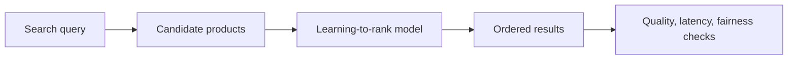
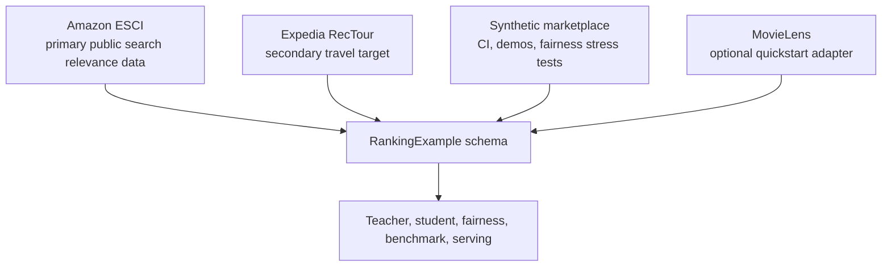
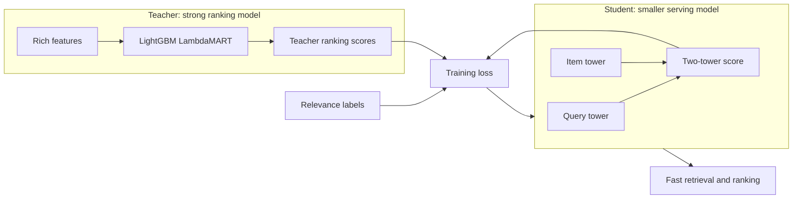
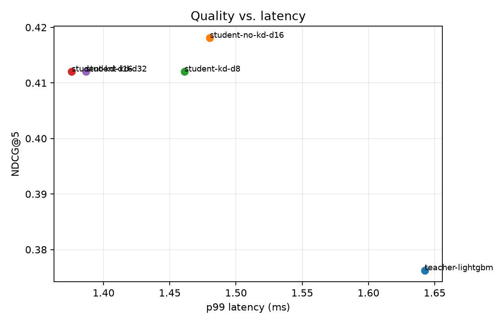
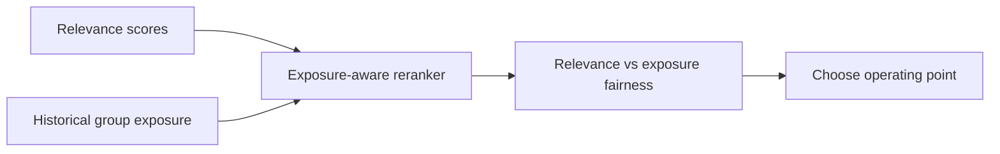
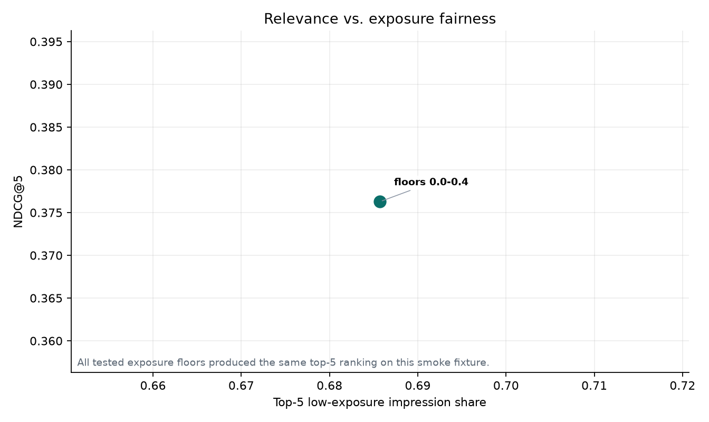
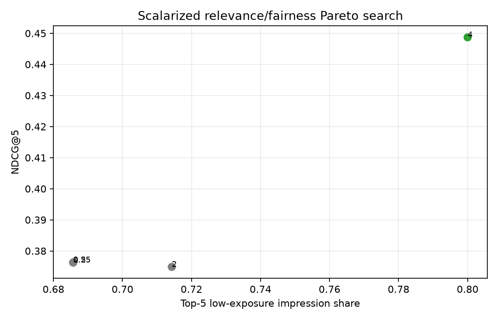
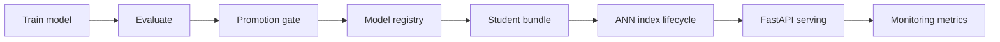

# Learning Guide

Author: Sarala Biswal

This guide explains the project as a visual walkthrough. Read it as a learning path: what problem
the repo solves, how data moves through the system, how teacher-student distillation works, and how
the research code becomes production-shaped ranking infrastructure.

For a browser-friendly version with summary, detailed, and technical flows, open
[`learning_flow.html`](learning_flow.html).

## 1. What This Project Teaches



The core problem is product ranking. Given a query and many candidate items, the system learns which
items should appear near the top. The project then asks a practical production question: can a
strong ranking model teach a smaller model that is easier to serve?

## 2. Dataset Adapters



Every dataset is converted into the same `RankingExample` contract. That keeps raw dataset logic
inside `adapters/` and lets the rest of the code work across domains.

Use the datasets this way:

| Dataset | Role | Why it exists |
|---|---|---|
| Amazon ESCI | Primary flow | Public query-product-relevance data for real learning-to-rank tests. |
| Expedia RecTour | Secondary target | Travel-marketplace shape, guarded until real files are available. |
| Synthetic | Fast fixture | Deterministic local tests and controlled marketplace stress cases. |
| MovieLens | Optional quickstart | Small familiar data for proving adapter portability. |

## 3. Teacher-Student Distillation



The teacher is optimized for ranking quality. The student is optimized for serving shape: query and
item embeddings can be used for retrieval, and item embeddings can be precomputed. Distillation is
the bridge between those goals.

The repo includes four training comparisons:

| Method | What it tests |
|---|---|
| No-KD student | Can the student learn only from labels? |
| Response-based KD | Can the student match the teacher's output scores? |
| Feature-based KD | Can the student match teacher representations? |
| Relation-based KD | Can the student preserve pairwise/listwise ordering? |

## 4. Evaluation Surface

```mermaid
flowchart LR
    Run[Benchmark run] --> Quality[NDCG@5 and NDCG@10]
    Run --> Latency[p50 and p99 latency]
    Run --> Size[Model size]
    Run --> Fairness[Exposure fairness]
    Run --> Gate[Promotion gate]
```

A ranking model is not judged by one number. The repo evaluates quality, latency, size, exposure
fairness, and promotion safety together.

The quality-vs-latency plot shows whether a candidate model is worth serving:



## 5. Fairness and Exposure



Ranking systems decide who receives attention. This project treats exposure as a supply-side
fairness proxy and shows the trade-off instead of hiding it behind a single threshold.





## 6. Production Lifecycle



The repo is intentionally more than a notebook. It includes a deployable skeleton: model bundles,
index lifecycle, a serving endpoint, monitoring metrics, load testing, and containerization.

## Suggested Walkthrough

1. Read `README.md` for the project summary and commands.
2. Read `src/learning_to_rank_distillation/schema.py` to understand `RankingExample`.
3. Read `src/learning_to_rank_distillation/adapters/esci.py` to see how real ESCI data enters the
   system.
4. Run a small benchmark with `ltrd benchmark --dataset esci --data-dir data/esci --limit 5000`.
5. Compare teacher and student rows in `benchmark_table.json`.
6. Inspect the fairness plots and promotion gate output.
7. Read `src/learning_to_rank_distillation/production/` to see how the trained student becomes a
   serving artifact.

## Learning Exercises

1. Change `--student-epochs` and see whether the student closes the gap with the teacher.
2. Try `student-kd-d8`, `student-kd-d16`, and `student-kd-d32` to inspect the quality-size trade-off.
3. Run the synthetic marketplace generator with higher exposure skew and inspect the fairness plots.
4. Add one feature to the ESCI adapter and check whether teacher or student quality changes.
5. Build a serving bundle and run the FastAPI endpoint locally.
